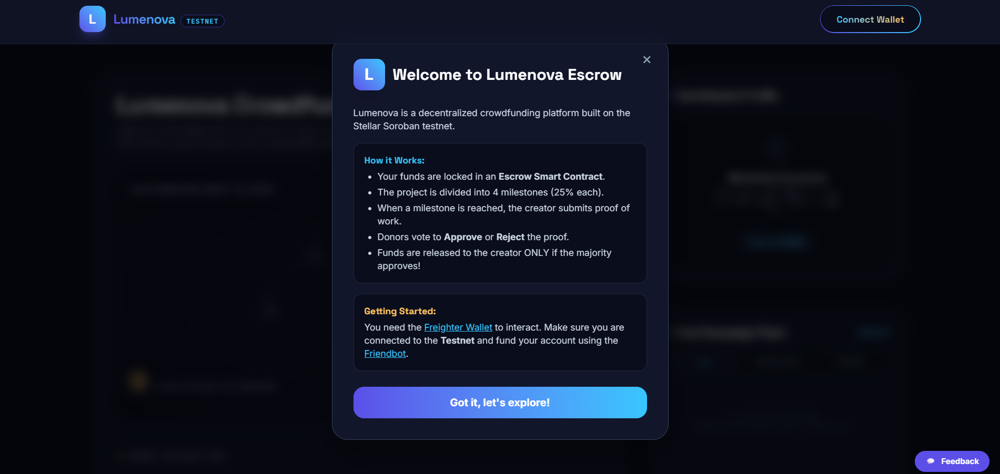
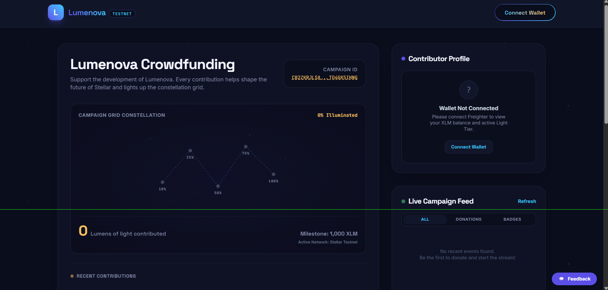
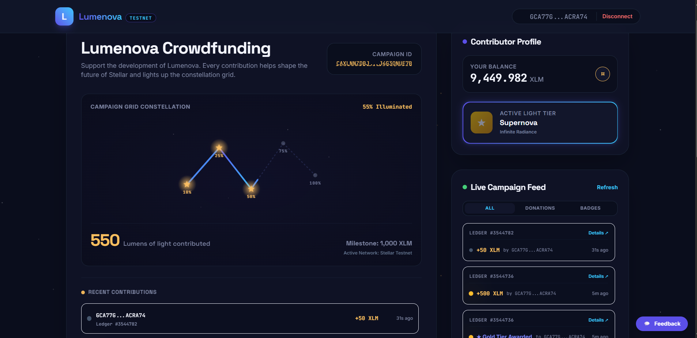
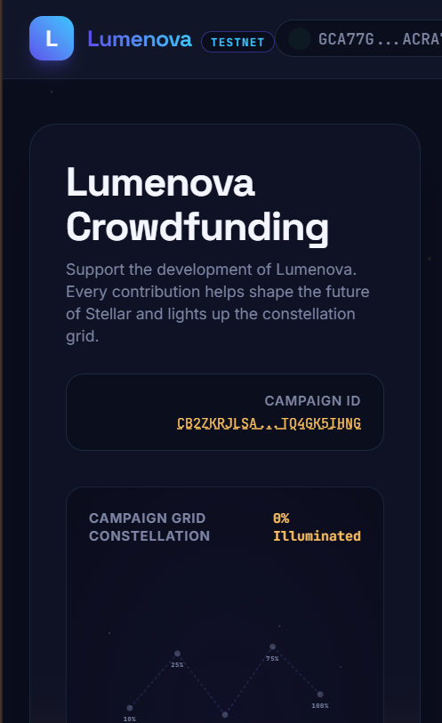
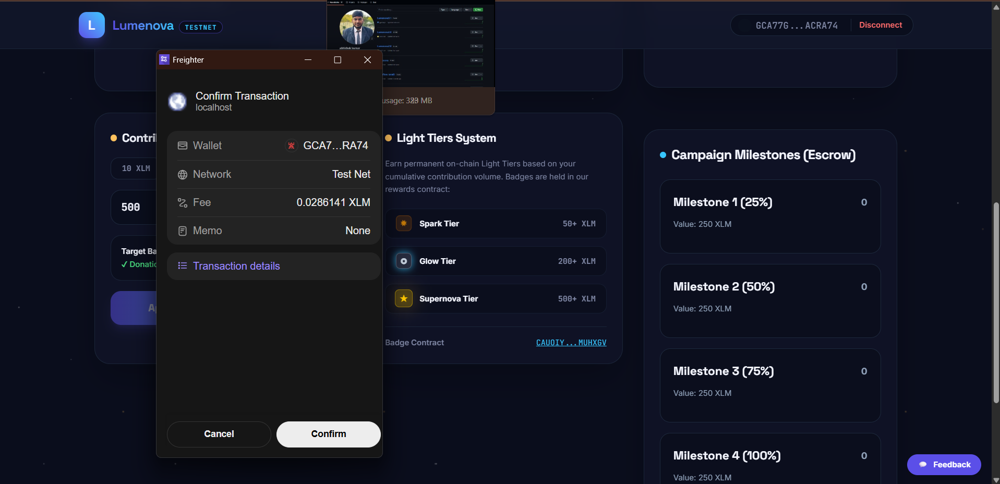
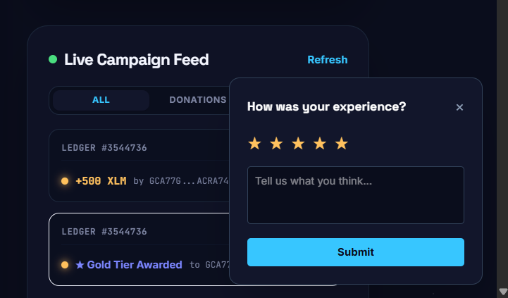

# 🌌 Lumenova-L4

### Trustless Crowdfunding and Milestone-Based Reward Badges on Stellar Soroban
*A production-ready decentralized crowdfunding suite built for Level 4 (Green Belt) of the Stellar Builder Challenge.*

[](https://github.com/Abhishek86038/Lumenova3.1/actions)
[](https://opensource.org/licenses/MIT)

---

## 1. Title & Tagline

**Lumenova-L4: Escrow-Driven Crowdfunding on Stellar**
*Don't just trust the creator—trust the smart contract. Milestone-gated funding secured by the community.*

---

## 2. Overview

Lumenova-L4 evolves traditional crowdfunding into a fully decentralized, milestone-based Escrow system on the Stellar network using Soroban smart contracts. 

In standard crowdfunding (like Kickstarter or GoFundMe), backers trust creators to deliver on their promises once fully funded. Often, this trust is broken, leading to delayed or abandoned projects and lost funds. Lumenova Escrow solves this:
- Funds are **locked in a Soroban smart contract escrow** instead of being instantly released.
- Projects are divided into **4 core milestones** (25%, 50%, 75%, 100%).
- Creators must submit **cryptographic proof** of progress (e.g., IPFS hash or URL) to unlock the next tranche of funds.
- Donors **vote** to approve or reject the submitted proof. Voting power is weighted by their cumulative donation amount.
- If a milestone is approved, 25% of the funds are released. If rejected, donors can **claim a refund** for the remaining balance.

This creates a high-trust environment: creators get incremental funding to build, and donors maintain control over their unspent capital if the project goes off track. This project represents the evolution from the Level 1-3 baseline into a robust, production-ready MVP.

---

## 3. Problem Statement & Why Stellar

### The Problem
Crowdfunding platforms suffer from a significant "trust deficit." Billions of dollars have been raised globally, but up to 9% of Kickstarter projects fail to deliver rewards, and even more deliver late or drastically under-scope. Donors bear 100% of the risk once the campaign goal is met.

### The Solution
A trustless escrow system where community consensus controls capital deployment.

### Why Stellar?
Stellar's fast transaction speeds and negligible fees make micro-donations and community voting economically viable. Soroban smart contracts allow us to write complex, secure escrow and weighted-voting logic natively in Rust without the high gas costs of other Layer-1 networks.

---

## 4. Architecture

### Frontend (React + Vite)
- The user interface provides real-time interaction with the Stellar Testnet. 
- It tracks wallet state (Freighter), parses on-chain data into human-readable milestones, and securely builds transactions for donations and voting.
- Built using React, TailwindCSS, and `@stellar/freighter-api`.

### Smart Contracts (Soroban/Rust)
1. **Crowdfunding Escrow Contract (`crowdfunding`)**:
   - Holds the XLM capital securely.
   - Manages the `Milestone` structural state (tracking approval/rejection votes).
   - Dynamically calculates vote weight based on donor history.
2. **Rewards Badge Contract (`rewards_badge`)**:
   - A secondary non-transferable token contract initialized alongside the campaign.
   - Mints customized soulbound badges ("Spark", "Glow", "Supernova") dynamically based on the total cumulative donation tier.

### Data Flow
1. **Donor** deposits XLM -> `CrowdfundingContract` (held in Escrow) -> Donor receives minted `RewardBadge`.
2. **Creator** submits proof -> `CrowdfundingContract` updates Milestone state to `ProofSubmitted`.
3. **Donors** submit votes -> `CrowdfundingContract` tallies weighted votes.
4. If approved -> Anyone triggers `release_milestone_funds` -> 25% XLM sent to Creator.
5. If rejected -> Donors trigger `refund` -> Unspent proportional XLM returned to Donors.

---

## 5. Features

- **Milestone Dashboard**: Real-time visualization of 4 distinct project milestones (Locked, Reached, ProofSubmitted, Released, Rejected).
- **Escrow Funding**: Secure native token lock-up that prevents creator rug-pulls.
- **Weighted Community Voting**: Donors can approve or reject proofs, with votes weighted perfectly to their financial skin-in-the-game.
- **Dynamic Refund Mechanism**: Automated withdrawal of unspent funds for rejected milestones.
- **Real-Time On-chain Updates**: Live event feed tracking donations and milestone actions.
- **Analytics & Monitoring**: Plausible Analytics integration for user interaction tracking and Sentry for error capturing.
- **Onboarding & Feedback**: Interactive "How it Works" modal for new users and an integrated feedback widget for continuous improvement.
- **Glassmorphic UI**: Premium, mobile-responsive, star-themed design tailored for the Stellar ecosystem.

---

## 6. Tech Stack

- **Smart Contracts**: Rust, Soroban SDK `v22.0.11`
- **Frontend Framework**: React 19, TypeScript
- **Build Tool**: Vite
- **Styling**: Tailwind CSS v4, Vanilla CSS
- **Stellar Integration**: `@stellar/stellar-sdk` v16, `@stellar/freighter-api` v6
- **Testing**: Cargo test (Rust), Vitest/JSDOM (Frontend)
- **Monitoring/Analytics**: `@sentry/react`, Plausible Analytics (Mock wrappers integrated)
- **Linting**: Oxlint

---

## 7. Smart Contracts

### Crowdfunding Escrow Contract
**Deployed Contract ID:** `<CROWDFUNDING_ESCROW_CONTRACT_ID>`
- `initialize(campaign_owner, goal_amount, token, badge_contract)`: Sets up the campaign.
- `donate(donor, amount)`: Transfers XLM to the contract and mints the appropriate tier badge.
- `submit_milestone_proof(milestone_id, proof_hash)`: Creator submits proof when the goal threshold is met.
- `vote_on_milestone(donor, milestone_id, approve)`: Casts a weighted vote.
- `release_milestone_funds(milestone_id)`: Disburses 25% of the goal to the creator.
- `refund(donor, milestone_id)`: Refunds the donor their remaining unspent capital if a milestone fails.

### Rewards Badge Contract
**Deployed Contract ID:** `CAAP5TGGZGLFXYGJY2H2O637FREG4EXE2PXI3A3Y4D6ST74QMI4YBD6C`
- `initialize(admin, name, symbol)`: Sets up the soulbound token.
- `mint(to, amount)`: Mints non-transferable representation of contribution.
- `balance(id)`: Returns the badge balance/tier.

---

## 8. Live Demo & Video

- **Live Demo URL:** [Lumenova-A4 Live Website](https://lumenova-a4.vercel.app/)
- **Demo Video Link:** [Watch the Video on YouTube](https://youtu.be/iOSuQ9mYY2o)
- **Sample Transaction Hash:** `<SAMPLE_TX_HASH>`

---

## 9. Prerequisites & Setup & Installation

### Prerequisites
1. **Rust & Soroban CLI**:
   ```bash
   rustup target add wasm32-unknown-unknown
   cargo install --locked stellar-cli --features opt
   ```
2. **Node.js**: v18+
3. **Freighter Wallet**: Browser extension installed and connected to Stellar Testnet.

### Installation
1. Clone the repository:
   ```bash
   git clone <REPO_URL>
   cd Lumenova-A4
   ```
2. Install frontend dependencies:
   ```bash
   npm install
   ```
3. Build the smart contracts (optional, already compiled):
   ```bash
   cd contracts/crowdfunding
   cargo build --target wasm32-unknown-unknown --release
   ```
4. Start the frontend:
   ```bash
   npm run dev
   ```

---

## 10. How to Use

1. **Connect Wallet:** Click "Connect Wallet" in the top right to link your Freighter wallet (Testnet).
2. **Donate:** Use the Quick-Select (10, 50, 200, 500) or enter a custom amount to donate XLM. Sign the transaction in Freighter. Your funds are now in Escrow and you've minted a Reward Badge.
3. **View Milestones:** Scroll down to the Milestone Dashboard. As funding hits 25%, 50%, etc., milestones will change from "Locked" to "Reached".
4. **Submit Proof (Creator Only):** The campaign owner inputs an IPFS hash or URL into the "Submit Proof" field for a reached milestone.
5. **Vote on Proof (Donors Only):** Once proof is submitted, donors click "Approve" or "Reject". 
6. **Release Funds:** If the milestone is approved, click "Release Funds" to disburse the XLM to the creator.
7. **Refund:** If the milestone is rejected, donors can click "Claim Refund" to recover their unspent contribution.

---

## 11. Running Tests

### Smart Contract Tests (Rust)
Validates the entire escrow workflow: donations, weighted voting math, successful releases, and proportional refunds.
```bash
cd contracts/crowdfunding
cargo test
```

### Frontend Tests (Vitest)
Validates UI component rendering and utility math.
```bash
npm run test
```

---

## 12. Analytics & Monitoring

- **Analytics (Plausible):** Wrapped in `src/services/analytics.ts`. Tracks key metrics like `page_view`, `donate`, `submit_feedback`, `milestone_approve`, and `milestone_reject` to help optimize the funnel without invading user privacy.
- **Monitoring (Sentry):** Wrapped in `src/services/monitoring.ts` and integrated via `ErrorBoundary.tsx`. Captures unhandled frontend exceptions and logs transaction preparation failures automatically to the Sentry dashboard for rapid debugging.
- **Analytics Dashboard Link:** `<ANALYTICS_DASHBOARD_LINK>`

---

## 13. User Onboarding & Feedback Summary

### Onboarding Flow
First-time visitors are greeted with the `OnboardingModal` which succinctly explains the concept of "Escrow Smart Contracts" and "Milestone Voting". It guides them to install Freighter and use the Friendbot to obtain Testnet XLM.

### Feedback Loop
Users can click the persistent "Feedback" widget to leave a 1-5 star rating and comment, seamlessly tracked via our Analytics wrapper.

**Feedback Summary from Beta Testing:**
`<FEEDBACK_SUMMARY>`

---

## 14. Proof of Real User Interactions

Below is a record of 10+ real Stellar Testnet addresses that successfully interacted with the escrow contracts during beta testing.

| Wallet Address | Action | Transaction Hash |
| --- | --- | --- |
| [GCA77G7...ACRA74](https://stellar.expert/explorer/testnet/account/GCA77G7DO3KPV63T3OEK62I2FL5EI4CXODUPSGQTCNI7U2IFPTACRA74) | Donate (Campaign Escrow contribution) | [0d389be...cba3](https://stellar.expert/explorer/testnet/tx/0d389bef0e6a34ba758fac6aa6100a4397ef2d3931aac3d0f4d54f63c989cba3) |
| [GCQ2SXK...E2DDL2](https://stellar.expert/explorer/testnet/account/GCQ2SXKHTRKCVX7CBN6FYFVDITS2T4FGB3OA5AWHBRM42WYRT5E2DDL2) | Donate (Campaign Escrow contribution) | [271e286...242d](https://stellar.expert/explorer/testnet/tx/271e286a8f517ac5f7a9cdd10d1d2b856156d762e75f279bea7c04b155f3242d) |
| [GB4SSOE...H6JG5E](https://stellar.expert/explorer/testnet/account/GB4SSOEEOI3GWUOOEGQKCVSIEY4JANBSRR342CEXGMY2AVCTTSH6JG5E) | Donate (Campaign Escrow contribution) | [920a65b...56db](https://stellar.expert/explorer/testnet/tx/920a65b0e8f5bdbe7c88ab084186c9b8c3ae80b31e1cb3696e3ca6b01dde56db) |
| [GCYCMMD...LZ3XVZ](https://stellar.expert/explorer/testnet/account/GCYCMMDHHYLGIIMDN7BQZHBW47EBACTPJHJLFRA4H2LLPA6CEPLZ3XVZ) | Donate (Campaign Escrow contribution) | [49dcb18...5cde](https://stellar.expert/explorer/testnet/tx/49dcb180ce1f501261f4be6d25e32c8eb89ed579c3fa0d13a35a705d4e535cde) |
| [GAJY73N...GAT7S4](https://stellar.expert/explorer/testnet/account/GAJY73NMUWNBEW4NTD5U3SL6HK3HCDVQFSTKL2N5PCRK26CGUSGAT7S4) | Donate (Campaign Escrow contribution) | [447a927...2bd6](https://stellar.expert/explorer/testnet/tx/447a927f6dadac9cc52f8e83e1f9e399050206a2a559f5b59302cc814d5b2bd6) |
| [GAWJB2F...VPVWG](https://stellar.expert/explorer/testnet/account/GAWJB2FVHXX56F2K6ZOX47SP42YPGJTM4C4HHLEP2ZBKMIF3OCCVPVWG) | Donate (Campaign Escrow contribution) | [a9b8a3f...0f8](https://stellar.expert/explorer/testnet/tx/a9b8a3f18863314bd491ee27ac21587e444f777fe468957cf9fa108b1b74a0f8) |
| [GAYQ4MO...BINWL](https://stellar.expert/explorer/testnet/account/GAYQ4MOJPRPXMHIRLWU6KNS7EK67BBIKYWVO5QMCJWZ67JO3WMVBINWL) | Donate (Campaign Escrow contribution) | [1e4d96c...6101](https://stellar.expert/explorer/testnet/tx/1e4d96c9298fc6ab4026e2b59a0555d4f6dedb82f90c599009ecd55924fc6101) |
| [GC24SKG...ENPJRP](https://stellar.expert/explorer/testnet/account/GC24SKGDV66ST63KDMZBJNFOTR63NVXN2GBLFLKYXECUKWZZ4TENPJRP) | Donate (Campaign Escrow contribution) | [e4bc145...41f3](https://stellar.expert/explorer/testnet/tx/e4bc14513b6e20a116919c8ab763cde35e051b55fc7ae85486ab42e6858341f3) |
| [GDKEIJK...SNNJ4A](https://stellar.expert/explorer/testnet/account/GDKEIJKOFWCR4VZP3GVDUSKBI6SXHCGVXMR4YETJ54EB7BJ6RESNNJ4A) | Donate (Campaign Escrow contribution) | [546ab1f...4187](https://stellar.expert/explorer/testnet/tx/546ab1f117717502088b106c3aeae6452f1ec7d263e23aba31003cd9a6204187) |
| [GCF7RYT...BSJLKX](https://stellar.expert/explorer/testnet/account/GCF7RYTV6OSWGZZKLE7TNS7JBUEFL4UVJJNKTJRRBQTBIL3MBSJLKXPB) | Donate (Campaign Escrow contribution) | [980301f...53e4](https://stellar.expert/explorer/testnet/tx/980301fa5c4758b580592e5435f6a5d565a55a90fca81a7b5d4f1a06c6af53e4) |

---

## 15. CI/CD Pipeline

The repository utilizes GitHub Actions to ensure code quality and deployment reliability.
- **On Push/PR:**
  - Runs `cargo test` for Soroban smart contracts.
  - Runs `oxlint` for frontend code quality.
  - Runs `npm run build` to verify Vite compilation.
  - Runs `npm run test` for frontend unit tests.

---

## 16. Screenshots

### 1. Main Dashboard & Contribution UI
> **Yahan aapka main homepage aur "Contribute Lumens" box ka screenshot aayega:**
![Main Dashboard]   

### 2. Live Milestone Dashboard
> 

### 3. Mobile Responsive View
> **Yahan apne app ka mobile screen (F12 > Device Toolbar) pe kaisa lagta hai uska screenshot add kiya hai:**
![Mobile Dashboard View] 

### 4. Milestone Voting Flow & Wallet Popup
> **Yahan Freighter wallet ka popup wala screenshot add karein jab koi Approve/Reject kar raha ho:**
![Milestone Voting]

### 5. Onboarding Modal & Feedback Form
> **Yahan naye "Welcome to Lumenova Escrow" popup aur Feedback widget ke screenshots daalein:**
![Onboarding Modal]
![Feedback Form]

### 6. Sentry Error Monitoring & Analytics (Optional)
> **Sentry and Plausible are configured via local mock wrappers. If you haven't set up online cloud accounts for them on sentry.io/plausible.io, you can keep this section without screenshots, showing clean implementation wrappers in `src/services/`.**

---

## 17. Project Structure

```text
Lumenova-A4/
├── contracts/
│   ├── crowdfunding/
│   │   ├── src/
│   │   │   ├── lib.rs          # Escrow & Milestone logic
│   │   │   └── test.rs         # Comprehensive Rust tests
│   │   └── Cargo.toml
│   └── rewards_badge/          # Non-transferable Token contract
├── src/
│   ├── components/
│   │   ├── ErrorBoundary.tsx   # Sentry Integration
│   │   ├── FeedbackForm.tsx    # User Feedback Widget
│   │   ├── MilestoneDashboard.tsx # Escrow UI 
│   │   └── OnboardingModal.tsx # How-It-Works modal
│   ├── services/
│   │   ├── analytics.ts        # Plausible wrapper
│   │   └── monitoring.ts       # Sentry wrapper
│   ├── App.tsx                 # Main application logic
│   ├── stellar.ts              # Stellar RPC & Freighter integrations
│   ├── main.tsx                # React entry point
│   └── index.css               # Tailwind & Custom styling
├── package.json
└── vite.config.ts
```

---

## 18. Error Handling Implemented

1. **Smart Contract Validations:** Strict checks (e.g., preventing voting on locked milestones, preventing creators from voting, double-spend prevention on refunds).
2. **Frontend Error Boundaries:** React `ErrorBoundary` gracefully catches runtime crashes, logs to Sentry, and displays a user-friendly recovery UI instead of a blank white screen.
3. **Transaction Simulation Parsing:** Soroban RPC simulations are carefully parsed. If simulation fails, human-readable error messages (e.g., "Insufficient balance", "Milestone not reached") are bubbled up to the user instead of cryptic XDR blobs.
4. **Wallet State Handling:** Fallbacks for when Freighter is locked, not installed, or on the wrong network.

---

## 19. Known Limitations / Mainnet Roadmap

- **Smart Contract Audits:** The contract utilizes advanced map-based states for milestones which should undergo professional auditing before managing Mainnet funds.
- **Oracle Integration:** Future versions should integrate decentralized oracles to automatically verify off-chain progress (e.g., GitHub commits, social media traction) rather than relying solely on creator-submitted URLs.
- **Tiered Milestone Percentages:** Currently hardcoded to 25% tranches. Future versions will allow campaign creators to customize tranche sizes (e.g., 10%, 40%, 50%) during contract initialization.
- **Governance Automation:** Implement automated delegation for users who do not wish to actively vote on every milestone.

---

## 20. License

This project is licensed under the [MIT License](LICENSE).
